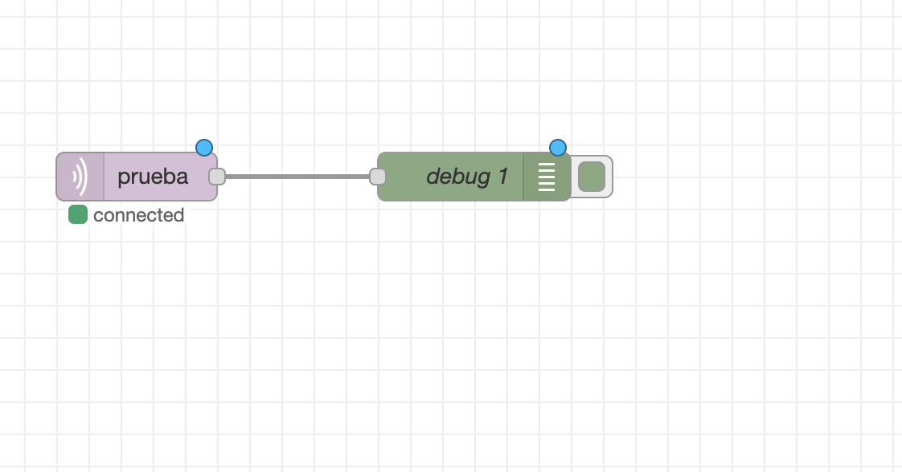
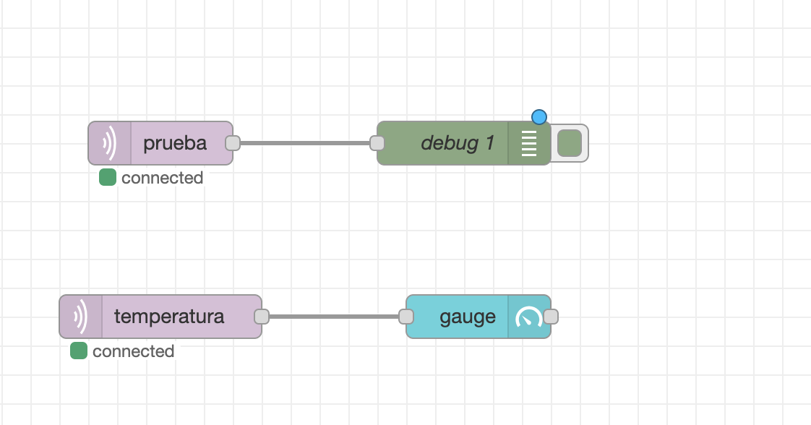
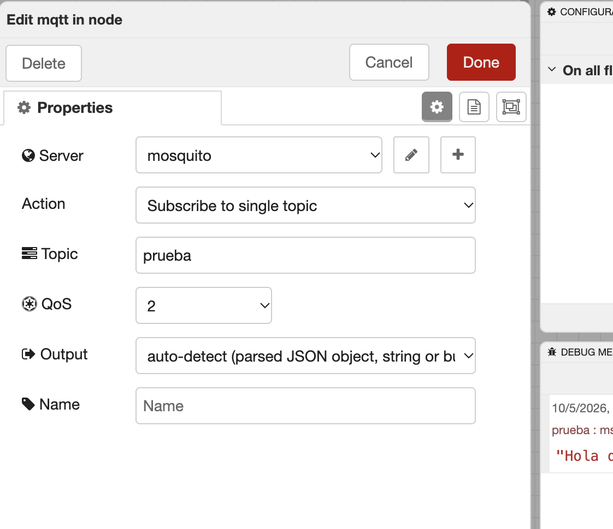
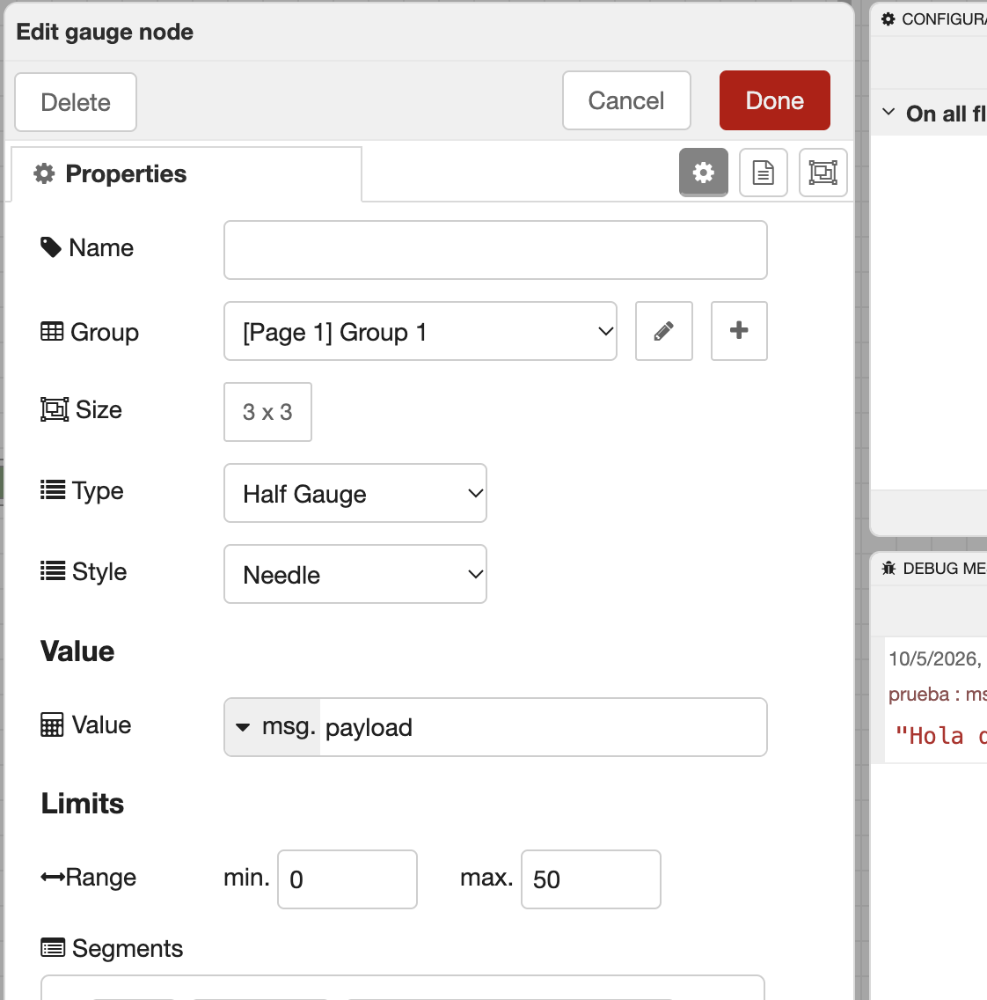
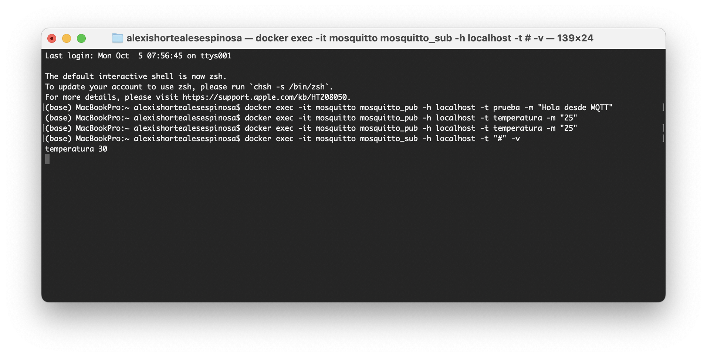
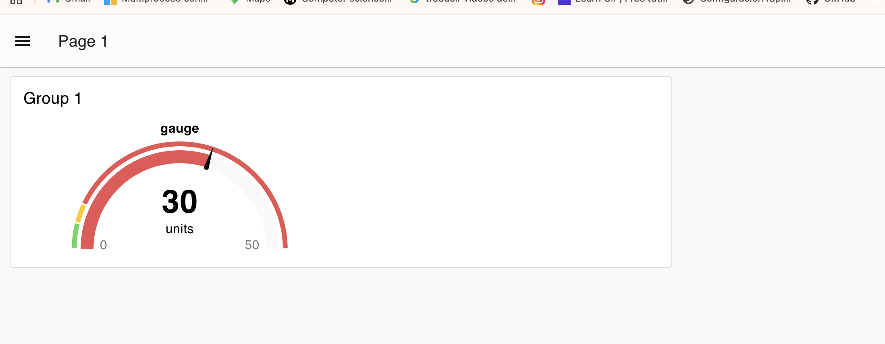

# Node-RED + Mosquitto MQTT + Dashboard (Docker)

Proyecto de prueba que conecta **Node-RED** con un broker **Mosquitto MQTT**, todo corriendo en Docker, y muestra los datos recibidos en un **dashboard** con un medidor (gauge).

```
Mac (mosquitto_pub)
        │  MQTT
        ▼
 Mosquitto :1883 ──────► Node-RED :1880 ──────► Dashboard /dashboard
```

## Contenido del repositorio

| Archivo | Descripción |
|---|---|
| `flows.json` | Flujos de Node-RED (mqtt in, debug, gauge) |
| `mosquitto.conf` | Configuración del broker (acepta conexiones externas) |
| `docker-compose.yml` | Levanta Mosquitto y Node-RED juntos |
| `.gitignore` | Evita subir archivos sensibles (`flows_cred.json`) |

## Requisitos

- [Docker Desktop](https://www.docker.com/products/docker-desktop/) instalado y ejecutándose
- Navegador web

## Instalación

### Opción A: con Docker Compose (recomendada)

```bash
git clone https://github.com/alex-hort/nodered-mqtt.git
cd nodered-mqtt
docker compose up -d
```

Para cargar los flujos, abre Node-RED y usa **Menú ☰ → Import** con el contenido de `flows.json`.

### Opción B: manualmente

```bash
docker volume create node_red_data
docker network create mqtt-network

docker run -d -p 1880:1880 -v node_red_data:/data --name mynodered nodered/node-red

docker run -d --name mosquitto --network mqtt-network -p 1883:1883 \
  -v $(pwd)/mosquitto.conf:/mosquitto/config/mosquitto.conf \
  eclipse-mosquitto

docker network connect mqtt-network mynodered
```

### Comprobar que todo corre

```bash
docker ps
```

Deben aparecer los contenedores `mynodered` (puerto 1880) y `mosquitto` (puerto 1883).

## Configuración en Node-RED

Abre **http://localhost:1880**.

Instala el dashboard: **Menú ☰ → Manage palette → Install** y busca:

```
@flowfuse/node-red-dashboard
```

### 1. Flujo de prueba: mqtt in → debug

Recibe mensajes del topic `prueba` y los muestra en el panel Debug.



### 2. Flujo completo: prueba + temperatura

Se agrega un segundo `mqtt in` con el topic `temperatura` conectado a un nodo `gauge`.



### 3. Configuración del nodo `mqtt in`

- **Server:** `mosquitto` (el nombre del contenedor, **no** `localhost`)
- **Port:** `1883`
- **Action:** Subscribe to single topic
- **Topic:** `prueba` / `temperatura`
- **QoS:** 2
- **Output:** auto-detect



### 4. Configuración del nodo `gauge`

- **Group:** `[Page 1] Group 1`
- **Type:** Half Gauge
- **Style:** Needle
- **Value:** `msg.payload`
- **Range:** min `0`, max `50`



Pulsa **Deploy** para activar los flujos. Los nodos `mqtt in` deben mostrar **connected**.

## Pruebas

### Enviar mensajes

```bash
docker exec -it mosquitto mosquitto_pub -h localhost -t prueba -m "Hola desde MQTT"
docker exec -it mosquitto mosquitto_pub -h localhost -t temperatura -m "30"
```

### Recibir mensajes en la terminal

```bash
docker exec -it mosquitto mosquitto_sub -h localhost -t "#" -v
```

Salida esperada:

```
temperatura 30
```



## Dashboard

Abre **http://localhost:1880/dashboard**. El medidor se mueve cada vez que se publica un valor en el topic `temperatura`.



## Conectar un dispositivo externo (ESP32, Arduino, celular)

El dispositivo debe conectarse a la IP de tu Mac, puerto `1883`, estando en la misma red Wi-Fi.

```bash
ipconfig getifaddr en0
```

Requiere `allow_anonymous true` en `mosquitto.conf` (ya incluido).

## Notas de seguridad

- `allow_anonymous true` es solo para pruebas en red local. En producción usa usuario y contraseña.
- No subas `flows_cred.json`: guarda credenciales.

## Tecnologías

- Docker
- Node-RED
- Eclipse Mosquitto (MQTT)
- Node-RED Dashboard
